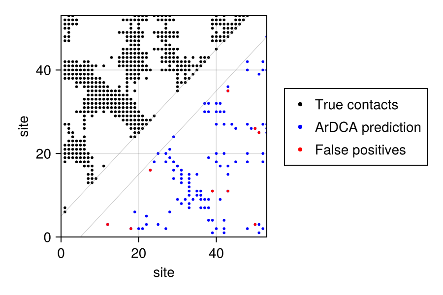

# Protein Structure Prediction

This repo contains a [notebook](protein_structure_prediction.ipynb) showcasing three physics-inspired methods to **predict the 3D structure of a family of proteins** starting from a Multiple Sequence Alignment.

Example output of a contact map prediction:

where in the top-left triangle are the true contacts between sites along the amino-acid chain, in the bottom-right the predicted ones.

It is written in Julia.

The packages implementing the three methods were written by their authors and are [GaussDCA.jl](https://github.com/carlobaldassi/GaussDCA.jl), [PlmDCA.jl](https://github.com/pagnani/PlmDCA.jl), [ArDCA.jl](https://github.com/pagnani/ArDCA.jl).
